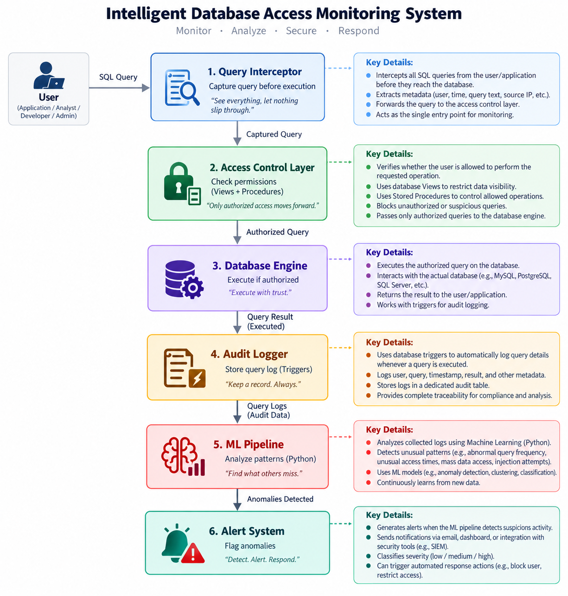
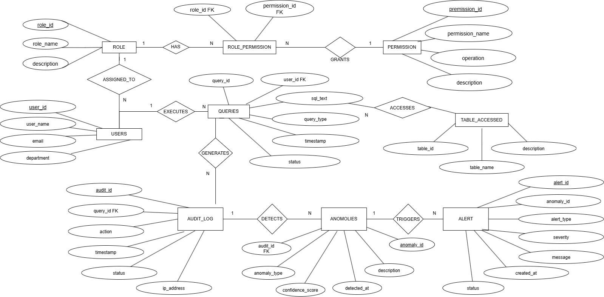

# Intelligent Database Access Control & Anomaly Detection System
## Learning + Implementation Roadmap

---

## 📚 Course Mapping: Syllabus Concepts → Project Implementation

| Phase | Syllabus Unit | Key Concepts | Project Implementation |
|-------|---------------|--------------|----------------------|
| **Phase 1** | Unit 1 & 2 | DBMS Fundamentals, Data Models | Project Architecture & Setup |
| **Phase 2** | Unit 3 | ER Modeling | Design Audit Database Schema |
| **Phase 3** | Unit 4 | SQL Basics | Query Logging & Basic Queries |
| **Phase 4** | Unit 6 | Normalization | Optimize Audit Schema (1NF → BCNF) |
| **Phase 5** | Unit 5 | MySQL Stored Procedures | Triggers, Procedures, Functions |
| **Phase 6** | Unit 7 | Transactions & Concurrency | ACID Guarantees for Audit Logs |
| **Phase 7** | N/A | Python + ML | Anomaly Detection Engine |
| **Phase 8** | Unit 9 | Distributed Databases | Cloud Deployment & Replication |

---

# 🚀 PHASE 1: DBMS Fundamentals & Project Architecture

## Learning Objectives
- Understand DBMS components and their role in this project
- Learn the relational model and its application
- Design overall system architecture

## Concepts to Learn

### 1.1 DBMS Fundamentals (Unit 1)
**Theory:**
- Why we need DBMS over file systems
- DBMS components: Query processor, storage manager, transaction manager
- DBMS vs File Systems comparison
- Characteristics: ACID properties, data integrity, security

**Project Context:**
In this project, we need:
- ✅ **Query Processor** — to intercept and log all queries
- ✅ **Storage Manager** — to efficiently store audit logs
- ✅ **Transaction Manager** — to ensure audit log consistency
- ✅ **Security Manager** — to enforce access control

**Assignment 1.1:** Write a 2-page document explaining:
- Why MySQL is chosen for this project (vs. file-based storage)
- How DBMS components work together in access control system
- Real example: User X runs a query → which DBMS components are involved?

---

### 1.2 Relational Model (Unit 2)
**Theory:**
- Relations, tuples, attributes
- Schema definition
- Keys: Primary Key, Foreign Key, Candidate Key, Super Key
- Integrity Constraints: Entity, Referential, Domain

**Project Context:**
Our audit system will have multiple entities:
- **Users** (username, user_id, department, role)
- **Queries** (query_id, user_id, sql_text, timestamp)
- **Roles** (role_id, role_name, permissions)

**Assignment 1.2:** Design the basic relational schema:
```
USERS (user_id, username, email, department, role_id)
ROLES (role_id, role_name, description)
TABLES_ACCESSED (table_name, table_id)
COLUMNS_ACCESSED (column_id, table_id, column_name)
```

---

### 1.3 System Architecture Overview
**High-Level Flow:**



**Assignment 1.3:** Draw and explain this architecture in detail.

---

## 🛠️ Practical Exercise 1

### Setup Your Development Environment

**Step 1: Install MySQL**
```bash
# Windows: Download from https://dev.mysql.com/downloads/mysql/
# macOS: brew install mysql
# Linux (Ubuntu/Debian): sudo apt-get install mysql-server

# Verify installation
mysql --version
```

**Step 2: Create Project Database**
```bash
# Login to MySQL (will ask for password)
mysql -u root -p

# In MySQL prompt, create database:
CREATE DATABASE access_control_db;
USE access_control_db;
```

**Step 3: Create Basic Tables**
```sql
-- Users table
CREATE TABLE users (
    user_id INT AUTO_INCREMENT PRIMARY KEY,
    username VARCHAR(50) UNIQUE NOT NULL,
    email VARCHAR(100),
    department VARCHAR(50),
    created_at TIMESTAMP DEFAULT CURRENT_TIMESTAMP
);

-- Roles table
CREATE TABLE roles (
    role_id INT AUTO_INCREMENT PRIMARY KEY,
    role_name VARCHAR(50) UNIQUE NOT NULL,
    description TEXT
);

-- Link users to roles
CREATE TABLE user_roles (
    user_id INT NOT NULL,
    role_id INT NOT NULL,
    PRIMARY KEY (user_id, role_id),
    FOREIGN KEY (user_id) REFERENCES users(user_id),
    FOREIGN KEY (role_id) REFERENCES roles(role_id)
);
```

**Step 4: Insert Sample Data**
```sql
INSERT INTO roles (role_name, description) VALUES
('Admin', 'Database administrator'),
('Analyst', 'Data analyst'),
('User', 'Regular user'),
('Finance', 'Finance department');

INSERT INTO users (username, email, department) VALUES
('alice', 'alice@company.com', 'Finance'),
('bob', 'bob@company.com', 'Engineering'),
('charlie', 'charlie@company.com', 'Finance');
```

**Deliverable:** Screenshot of successful table creation and data insertion.

---

## 📋 Checklist for Phase 1
- [ ] Understand DBMS components
- [ ] Learn relational model concepts
- [ ] Design initial relational schema
- [ ] Setup MySQL
- [ ] Create basic tables
- [ ] Insert sample data
- [ ] Document architecture

---

# 🎯 PHASE 2: Entity-Relationship (ER) Modeling

## Learning Objectives
- Design complete ER diagram for the project
- Understand relationships between entities
- Apply EER concepts for extended functionality

## Concepts to Learn

### 2.1 ER Concepts (Unit 3)
**Theory:**
- Entities and Attributes (Simple, Composite, Derived)
- Relationships and Cardinality (1:1, 1:N, M:N)
- Participation (Total vs Partial)
- Enhanced ER (Generalization, Specialization)

### 2.2 Project ER Diagram



**Assignment 2.1:** Create your ER diagram using:
- Draw.io (free tool)
- Lucidchart
- ERDPlus

Clearly show:
- All entities with attributes
- Primary keys and foreign keys
- Cardinality (1:1, 1:N, M:N)
- Participation constraints

---

## 🛠️ Practical Exercise 2

### Create Complete Audit Database Schema

```sql
-- ============================================
-- PHASE 2: COMPLETE SCHEMA CREATION (MySQL)
-- ============================================

-- 1. USERS TABLE
CREATE TABLE users (
    user_id INT AUTO_INCREMENT PRIMARY KEY,
    username VARCHAR(50) UNIQUE NOT NULL,
    email VARCHAR(100) NOT NULL,
    department VARCHAR(50) NOT NULL,
    created_at TIMESTAMP DEFAULT CURRENT_TIMESTAMP,
    is_active TINYINT(1) DEFAULT 1
) ENGINE=InnoDB DEFAULT CHARSET=utf8mb4;

-- 2. ROLES TABLE
CREATE TABLE roles (
    role_id INT AUTO_INCREMENT PRIMARY KEY,
    role_name VARCHAR(50) UNIQUE NOT NULL,
    description TEXT,
    permission_level INT CHECK (permission_level BETWEEN 1 AND 10)
) ENGINE=InnoDB DEFAULT CHARSET=utf8mb4;

-- 3. USER_ROLES JUNCTION TABLE (M:N)
CREATE TABLE user_roles (
    user_role_id INT AUTO_INCREMENT PRIMARY KEY,
    user_id INT NOT NULL,
    role_id INT NOT NULL,
    assigned_at TIMESTAMP DEFAULT CURRENT_TIMESTAMP,
    UNIQUE(user_id, role_id),
    FOREIGN KEY (user_id) REFERENCES users(user_id) ON DELETE CASCADE,
    FOREIGN KEY (role_id) REFERENCES roles(role_id) ON DELETE CASCADE
) ENGINE=InnoDB DEFAULT CHARSET=utf8mb4;

-- 4. RESOURCES TABLE (Tables/Views in database)
CREATE TABLE resources (
    resource_id INT AUTO_INCREMENT PRIMARY KEY,
    resource_name VARCHAR(100) UNIQUE NOT NULL,
    resource_type VARCHAR(20) CHECK (resource_type IN ('TABLE', 'VIEW', 'FUNCTION')),
    sensitivity_level VARCHAR(20) CHECK (sensitivity_level IN ('PUBLIC', 'INTERNAL', 'CONFIDENTIAL', 'SECRET')),
    description TEXT
) ENGINE=InnoDB DEFAULT CHARSET=utf8mb4;

-- 5. ROLE_PERMISSIONS TABLE (M:N: Roles can have many Permissions on Resources)
CREATE TABLE role_permissions (
    permission_id INT AUTO_INCREMENT PRIMARY KEY,
    role_id INT NOT NULL,
    resource_id INT NOT NULL,
    operation VARCHAR(20) CHECK (operation IN ('SELECT', 'INSERT', 'UPDATE', 'DELETE', 'ALL')),
    granted_at TIMESTAMP DEFAULT CURRENT_TIMESTAMP,
    UNIQUE(role_id, resource_id, operation),
    FOREIGN KEY (role_id) REFERENCES roles(role_id) ON DELETE CASCADE,
    FOREIGN KEY (resource_id) REFERENCES resources(resource_id) ON DELETE CASCADE
) ENGINE=InnoDB DEFAULT CHARSET=utf8mb4;

-- 6. QUERY_LOGS TABLE (Core Audit Table)
CREATE TABLE query_logs (
    log_id INT AUTO_INCREMENT PRIMARY KEY,
    user_id INT NOT NULL,
    query_text TEXT NOT NULL,
    query_hash VARCHAR(64),
    timestamp TIMESTAMP DEFAULT CURRENT_TIMESTAMP,
    execution_time_ms INT,
    status VARCHAR(20) CHECK (status IN ('SUCCESS', 'FAILURE', 'BLOCKED')),
    error_message TEXT,
    database_name VARCHAR(50),
    session_id VARCHAR(100),
    FOREIGN KEY (user_id) REFERENCES users(user_id)
) ENGINE=InnoDB DEFAULT CHARSET=utf8mb4;

-- 7. ACCESSED_RESOURCES TABLE (What did this query access?)
CREATE TABLE accessed_resources (
    access_id INT AUTO_INCREMENT PRIMARY KEY,
    log_id INT NOT NULL,
    resource_id INT NOT NULL,
    operation VARCHAR(20),
    rows_affected INT,
    UNIQUE(log_id, resource_id),
    FOREIGN KEY (log_id) REFERENCES query_logs(log_id) ON DELETE CASCADE,
    FOREIGN KEY (resource_id) REFERENCES resources(resource_id)
) ENGINE=InnoDB DEFAULT CHARSET=utf8mb4;

-- 8. ANOMALY_ALERTS TABLE
CREATE TABLE anomaly_alerts (
    alert_id INT AUTO_INCREMENT PRIMARY KEY,
    log_id INT NOT NULL,
    alert_type VARCHAR(50) CHECK (alert_type IN ('BEHAVIORAL', 'POLICY_VIOLATION', 'THRESHOLD_EXCEEDED')),
    severity VARCHAR(10) CHECK (severity IN ('LOW', 'MEDIUM', 'HIGH', 'CRITICAL')),
    anomaly_score DECIMAL(5,4) CHECK (anomaly_score BETWEEN 0 AND 1),
    description TEXT,
    created_at TIMESTAMP DEFAULT CURRENT_TIMESTAMP,
    acknowledged TINYINT(1) DEFAULT 0,
    acknowledged_by INT,
    acknowledged_at TIMESTAMP NULL,
    FOREIGN KEY (log_id) REFERENCES query_logs(log_id),
    FOREIGN KEY (acknowledged_by) REFERENCES users(user_id)
) ENGINE=InnoDB DEFAULT CHARSET=utf8mb4;

-- 9. USER_BASELINE TABLE (For ML: Normal behavior patterns)
CREATE TABLE user_baseline (
    baseline_id INT AUTO_INCREMENT PRIMARY KEY,
    user_id INT NOT NULL UNIQUE,
    avg_queries_per_hour DECIMAL(10,2),
    avg_execution_time_ms INT,
    preferred_resources TEXT,
    preferred_operations TEXT,
    last_updated TIMESTAMP DEFAULT CURRENT_TIMESTAMP,
    FOREIGN KEY (user_id) REFERENCES users(user_id) ON DELETE CASCADE
) ENGINE=InnoDB DEFAULT CHARSET=utf8mb4;

-- 10. ACCESS_POLICIES TABLE
CREATE TABLE access_policies (
    policy_id INT AUTO_INCREMENT PRIMARY KEY,
    policy_name VARCHAR(100) UNIQUE NOT NULL,
    description TEXT,
    rule_type VARCHAR(50) CHECK (rule_type IN ('TIME_BASED', 'DATA_VOLUME', 'RESOURCE_BASED', 'CUSTOM')),
    rule_definition JSON,
    is_active TINYINT(1) DEFAULT 1,
    created_at TIMESTAMP DEFAULT CURRENT_TIMESTAMP
) ENGINE=InnoDB DEFAULT CHARSET=utf8mb4;

-- 11. POLICY_VIOLATIONS TABLE
CREATE TABLE policy_violations (
    violation_id INT AUTO_INCREMENT PRIMARY KEY,
    log_id INT NOT NULL,
    policy_id INT NOT NULL,
    violation_details TEXT,
    flagged_at TIMESTAMP DEFAULT CURRENT_TIMESTAMP,
    FOREIGN KEY (log_id) REFERENCES query_logs(log_id),
    FOREIGN KEY (policy_id) REFERENCES access_policies(policy_id)
) ENGINE=InnoDB DEFAULT CHARSET=utf8mb4;

-- ============================================
-- INDEXES FOR PERFORMANCE (Unit 6 optimization)
-- ============================================

CREATE INDEX idx_query_logs_user_id ON query_logs(user_id);
CREATE INDEX idx_query_logs_timestamp ON query_logs(timestamp);
CREATE INDEX idx_query_logs_status ON query_logs(status);
CREATE INDEX idx_anomaly_alerts_log_id ON anomaly_alerts(log_id);
CREATE INDEX idx_accessed_resources_log_id ON accessed_resources(log_id);
CREATE INDEX idx_user_baseline_user_id ON user_baseline(user_id);

-- ============================================
-- SAMPLE DATA
-- ============================================

INSERT INTO roles (role_name, description, permission_level) VALUES
('Database Admin', 'Full database access', 10),
('Data Analyst', 'Read-only access to most tables', 6),
('Finance User', 'Finance table access only', 4),
('Guest', 'Very limited read access', 1);

INSERT INTO users (username, email, department) VALUES
('alice_admin', 'alice@company.com', 'IT'),
('bob_analyst', 'bob@company.com', 'Analytics'),
('charlie_finance', 'charlie@company.com', 'Finance'),
('diana_user', 'diana@company.com', 'HR');

INSERT INTO resources (resource_name, resource_type, sensitivity_level) VALUES
('customers', 'TABLE', 'CONFIDENTIAL'),
('employees', 'TABLE', 'SECRET'),
('orders', 'TABLE', 'INTERNAL'),
('finance_summary', 'VIEW', 'CONFIDENTIAL');
```

**Deliverable:** 
- SQL script saved and executed successfully
- Show table structure with `DESCRIBE table_name;` or `SHOW CREATE TABLE table_name;`

---

## 📋 Checklist for Phase 2
- [ ] Learn ER modeling concepts
- [ ] Draw complete ER diagram for the project
- [ ] Understand cardinality and relationships
- [ ] Create all tables with proper constraints
- [ ] Insert sample data
- [ ] Create indexes for performance

---

## 🎯 Next Steps
We'll continue with:
- **Phase 3:** SQL Basics - Writing queries on this schema
- **Phase 4:** Normalization - Optimize the schema to BCNF
- **Phase 5:** MySQL Stored Procedures - Triggers and procedures for logging
- **Phase 6:** Transactions - ACID guarantees for audit logs
- **Phase 7:** Python ML - Anomaly detection

---

## 📚 Resources
- MySQL Documentation: https://dev.mysql.com/doc/
- MySQL Tutorial: https://www.w3schools.com/mysql/
- ER Diagram Tool: https://www.erdplus.com/
- W3Schools SQL: https://www.w3schools.com/sql/
- Your Textbook: Silberschatz Database System Concepts, Chapter 2-3