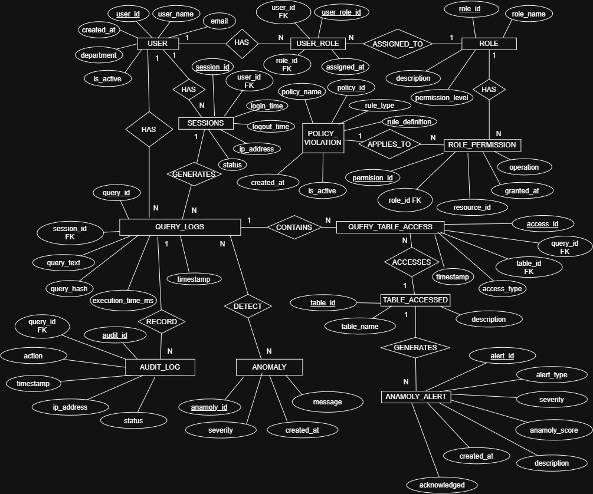

# Project Overview

## Intelligent Database Access Control & Anomaly Detection System

### Problem Statement
Organizations face significant risks from insider threats and unauthorized database access. Traditional access control mechanisms cannot effectively detect suspicious query patterns or behavioral anomalies in real-time, leaving sensitive data vulnerable to misuse, data theft, and compliance violations.

### Solution
This project implements an **enterprise-grade database security system** that combines robust access control with AI-powered anomaly detection. The system monitors all database queries, builds behavioral baselines for users, and automatically detects suspicious activities that may indicate insider threats or unauthorized data access.

### Key Features

🔐 **Query-Level Access Control**
- Role-based access control with SQL views
- Column-level and row-level security enforcement
- Fine-grained permission management

📝 **Comprehensive Audit Logging**
- Real-time logging of all database queries and data access
- Metadata capture: user, timestamp, resource, operation type
- Optimized storage using normalized schemas and indexing

🤖 **ML-Powered Anomaly Detection**
- Behavioral baseline learning from historical access patterns
- Real-time threat scoring using ML models
- Automatic flagging of suspicious queries and unusual access patterns

⚡ **High-Performance Analysis**
- Efficient indexing strategies for fast query analysis on massive audit logs
- Optimized stored procedures for complex pattern detection
- Sub-second response times for access decisions

☁️ **Cloud-Ready Architecture**
- Distributed database support
- Multi-region replication for disaster recovery
- Scalable design for enterprise workloads

### Technologies Used
- **Database**: MySQL / Oracle
- **Backend**: Python (ML Pipeline)
- **Database Logic**: PL/SQL (Triggers, Stored Procedures, Views)
- **ML Framework**: scikit-learn / TensorFlow
- **Cloud**: AWS RDS / Google Cloud SQL / Azure Database

### Real-World Applications
✓ Detect insider threats in financial institutions  
✓ Prevent data theft in healthcare organizations  
✓ Ensure GDPR/compliance monitoring  
✓ Enterprise security operations centers (SOCs)

## 🗄️ Database Design

The system uses a relational database designed to provide secure access
control, query monitoring, policy enforcement, audit tracking, and
anomaly detection.

The database consists of the following core entities:

- **USER** – Stores user account details such as user ID, username, email,
  department, account status, and creation date.

- **ROLE** – Defines the roles available within the system.

- **USER_ROLE** – Establishes the relationship between users and their
  assigned roles, including role assignment details.

- **SESSIONS** – Maintains user session information including login time,
  logout time, IP address, and session status.

- **ROLE_PERMISSION** – Defines the permissions associated with each role,
  including operations and accessible resources.

- **POLICY_VIOLATION** – Records violations related to security policies,
  including policy rules, violation details, and status.

- **QUERY_LOGS** – Stores database query activity including query text,
  query hash, execution time, timestamp, and associated session.

- **QUERY_TABLE_ACCESS** – Maps executed queries to the database tables
  they access and records the type and time of access.

- **TABLE_ACCESSED** – Stores information about database tables monitored
  by the system.

- **AUDIT_LOG** – Maintains an audit trail of database activities,
  including actions, timestamps, IP addresses, and status.

- **ANOMALY** – Stores detected anomalous activities along with anomaly
  severity, message, and creation time.

- **ANOMALY_ALERT** – Generates and maintains alerts for detected
  anomalies, including alert type, severity, anomaly score,
  acknowledgement status, and description.

### 🔗 Database Relationships

The major relationships in the database are:

- **USER → USER_ROLE**: A user can have multiple role assignments.
- **USER_ROLE → ROLE**: Each role assignment is associated with a role.
- **USER → SESSIONS**: A user can create multiple sessions.
- **SESSIONS → QUERY_LOGS**: A session can generate multiple query logs.
- **ROLE → ROLE_PERMISSION**: A role can have multiple permissions.
- **QUERY_LOGS → QUERY_TABLE_ACCESS**: A query can contain multiple
  table-access records.
- **QUERY_TABLE_ACCESS → TABLE_ACCESSED**: Table-access records identify
  the accessed database tables.
- **QUERY_LOGS → AUDIT_LOG**: Query activities can be recorded in the
  audit trail.
- **QUERY_LOGS → ANOMALY**: Query activities are analyzed for anomalous
  behavior.
- **ANOMALY → ANOMALY_ALERT**: Detected anomalies can generate alerts.
- **ROLE_PERMISSION → POLICY_VIOLATION**: Permission-related activities
  can be evaluated against security policies.

### 🛡️ Security Monitoring Flow

The database supports the following security monitoring flow:

**User → Session → Query Logs → Table Access**

with parallel security tracking through:

**Query Logs → Audit Logs**

and:

**Query Logs → Anomaly Detection → Anomaly Alerts**

This relational structure enables ANOMEX to maintain a traceable record
of database access activities while supporting access control,
monitoring, auditing, and anomaly detection.

## 📊 ER Diagram

## ✨ Key Features

- User authentication
- Role-based access control
- Query monitoring
- Query logging
- Audit logging
- Anomaly detection
- Anomaly alerts

## 👥 Team

Team Rocket!!

## 📄 Project Status

Under Development...
